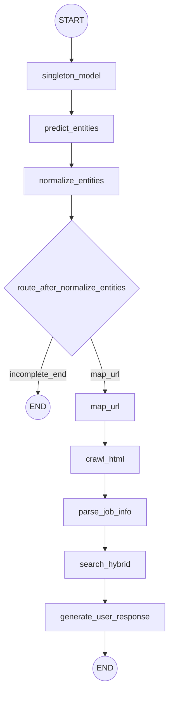

# AI 기반 채용공고 검색 시스템 보고서

이 문서는 `LangGraph` 기반 채용공고 검색 파이프라인의 구조, 실행, 워크플로우, 노드 단위 동작, 출력 형식, 디렉토리 설계를 한 번에 이해할 수 있도록 정리한 프로젝트 보고서다.

## 1. 프로젝트 소개

### 1.1 목적

사용자가 자연어로 입력한 채용 검색 요청에서 핵심 조건을 추출하고, 이를 바탕으로 사람인 검색 URL 생성, 공고 수집, 공고 파싱, 하이브리드 검색(BM25+임베딩), 최종 응답 생성을 자동화한다.

### 1.2 문제 정의

기존 키워드 검색은 사용자의 복합 질의를 충분히 반영하지 못한다. 예를 들어 `서울 백엔드 신입 대졸`과 같은 문장은 지역, 직무, 경력, 학력 슬롯을 동시에 만족해야 하지만, 단일 키워드 매칭만으로는 검색 정확도가 낮아진다.

### 1.3 핵심 가치

- `슬롯 기반 질의 이해`: `지역/직무/경력/학력` 4개 슬롯을 기준으로 질의를 구조화한다.
- `결손 정보 분기`: 필수 정보가 부족하면 즉시 `incomplete` 상태로 종료해 후속 입력을 유도한다.
- `실행 경로 표준화`: `src/graph.py`를 중심으로 모든 단계를 노드 체인으로 고정한다.
- `재현 가능한 검색`: URL 매핑 규칙(`data/url_exchager/query_map.json`)과 동의어 정규화(`data/url_exchager/synonym_dict.json`)를 데이터 파일로 관리한다.

### 1.4 핵심 기능

- NER 기반 슬롯 추출(`src/node.py::predict_ner`)
- 슬롯 정규화 및 누락 검증(`src/tools/slices/entity_normalizer.py`)
- URL 매핑 및 크롤링(`src/node.py::mapping_url_query_node`, `crawl_job_html_from_saramin`)
- HTML 파싱 및 검색 문서 생성(`src/tools/slices/parsing.py`)
- 하이브리드 검색 및 랭킹(`src/tools/slices/retrieval.py`)
- 최종 자연어 응답 생성(`src/tools/slices/llm.py`)

### 1.5 파이프라인 개요

실행 진입점은 `run_local.py`의 `run()`이며 내부적으로 `src/graph.py::run_job_search_graph()`를 호출한다. 그래프는 조건 분기를 포함해 다음 두 흐름 중 하나로 종료된다.

- `정보 부족 종료`: `normalize_entities` 후 `incomplete_end`로 `END`
- `검색 완료 종료`: `map_url -> crawl_html -> parse_job_info -> search_hybrid -> generate_user_response -> END`

## 2. 실행방법

### 2.1 환경 요구사항

- `Python`: `>=3.12,<3.13` (`pyproject.toml` 기준)
- `패키지 매니저`: `uv`
- `크롤링 방식`: `requests` + `beautifulsoup4` + `view-ajax` + `ThreadPoolExecutor(3)`
- `환경변수 파일`: 프로젝트 루트의 `.env`

### 2.2 의존성 설치

```bash
uv sync
```

개발용 도구까지 함께 설치하려면 다음을 사용한다.

```bash
uv sync --group dev
```

### 2.3 환경변수 준비

`.env`에 최소 아래 키들을 설정한다.

- `USE_OPENAI_MODELS`
- `OPENAI_API_KEY` (OpenAI 모드 사용 시)
- `NER_MODEL_NAME`
- `RESPONSE_MODEL_NAME`
- `OPENAI_TIMEOUT_SECONDS`
- `OPENAI_MAX_RETRIES`
- `OPENAI_BASE_URL`
- `MAX_JOBS`
- `TOP_K`

### 2.4 로컬 단일 실행

```bash
uv run python run_local.py
```

기본 입력 문장은 `run_local.py` 내부에 하드코딩되어 있으며, 실행 시 최종 상태 딕셔너리가 출력된다.

### 2.5 LangGraph 개발 서버 실행

```bash
uv run langgraph dev
```

그래프 엔트리는 `langgraph.json`의 아래 설정을 사용한다.

- 그래프 이름: `job_search`
- 진입점: `./src/graph.py:get_compiled_graph`
- 환경파일: `.env`

### 2.6 프론트엔드/백엔드 연동 및 E2E 테스트 방식

- 프론트엔드는 별도 Netlify 배포 환경에 업로드해 배포 상태에서도 동작을 확인했다.
- 실제 기능 검증 단계에서는 빠른 수정과 API URL 전환을 위해 프론트엔드 로컬 서버를 실행했다.
- 백엔드는 현재 저장소의 `Dockerfile`로 이미지를 빌드한 뒤 컨테이너를 실행해 내부에서 `FastAPI` 서버를 구동했다.
- 프론트엔드 로컬 서버와 백엔드 컨테이너 URL을 연결해 검색 요청, 응답 수신, 화면 반영까지 전체 흐름을 end-to-end로 검증했다.
- 브라우저 자동화 검증은 `Playwright`를 사용해 실제 사용자 동선 기준으로 반복 테스트했다.

## 3. 워크플로우(머메이드)

아래 다이어그램은 `src/graph.py`의 실제 노드 연결 순서를 반영한다.



## 4. 노드별 상세 동작

| 노드 | 입력 상태 키 | 상세 처리 | 출력 상태 키 |
| --- | --- | --- | --- |
| `singleton_model` | `bert_model_name`(옵션) | 모델 캐시를 초기화/재사용하고 실행 장치와 NER/임베딩/응답 생성 함수를 준비한다. | `bert_model_name`, `device`, `bert_model`, `tokenizer`, `crf`, `embedding_model`, `llm` |
| `predict_entities` | `user_input` | `predict_ner()`로 `지역/직무/경력/학력`을 추출한다. 설정값에 따라 OpenAI 구조화 출력 또는 BERT+CRF 분기를 사용한다. | `entities`, `지역`, `직무`, `경력`, `학력` |
| `normalize_entities` | `entities` 또는 개별 슬롯 키 | 동의어 사전(`data/url_exchager/synonym_dict.json`)으로 표준화하고 누락 슬롯을 검사한다. | `status`, `message`, `missing_fields`, `normalized_entities` |
| `map_url` | `normalized_entities` | 슬롯 값을 `query_map.json` 코드로 변환해 사람인 검색 URL을 조합하고 고정 파라미터(`edu_none=y`, `exp_none=y`)를 추가한다. | `url` |
| `crawl_html` | `url`, `max_jobs`(옵션) | 목록 HTML에서 `rec_idx`를 추출한 뒤 `view-ajax` 상세를 3개 워커로 병렬 수집해 핵심 HTML 블록을 조합한다. | `html_contents`, `crawled_count` |
| `parse_job_info` | `html_contents` | 제목/요약/복리후생/위치/상세/접수/지원자/기업정보를 텍스트 문서로 파싱한다. | `job_info_list` |
| `search_hybrid` | `query`, `job_info_list`, `retriever`, 검색 옵션 키들 | BM25와 임베딩 결과를 결합(`weighted_average` 또는 `rrf`)해 상위 문서를 반환한다. | `retriever`, `retrieved_job_info_list`, `retrieved_scores` |
| `generate_user_response` | `query`, `retrieved_job_info_list`(없으면 `job_info_list` fallback) | 검색 결과 문서를 기반으로 최종 사용자 응답을 생성한다. | `user_response` |

라우팅 함수 `route_after_normalize_entities`는 `status`, `missing_fields`, `normalized_entities`를 기준으로 다음 노드를 결정한다.

- `ROUTE_INCOMPLETE_END`: 정보 부족 종료 분기
- `ROUTE_MAP_URL`: 검색 진행 분기

## 5. 최종 출력

그래프 실행 결과는 `GraphState` 기반 딕셔너리다. 주요 종료 시나리오는 아래 두 가지다.

### 5.1 시나리오 A: 정보 부족 종료 (`status=incomplete`)

```json
{
  "user_input": "백엔드 신입 채용공고 찾아줘",
  "query": "백엔드 신입 채용공고 찾아줘",
  "entities": {
    "지역": "",
    "직무": "백엔드",
    "경력": "신입",
    "학력": ""
  },
  "status": "incomplete",
  "message": "지역, 학력 정보를 알려주세요.",
  "missing_fields": ["지역", "학력"],
  "normalized_entities": {
    "지역": null,
    "직무": "백엔드/서버개발",
    "경력": "신입",
    "학력": null
  }
}
```

### 5.2 시나리오 B: 전체 파이프라인 완료 (`user_response` 포함)

```json
{
  "user_input": "서울 AI 엔지니어 신입 고졸 채용공고 찾아줘.",
  "query": "서울 AI 엔지니어 신입 고졸 채용공고 찾아줘.",
  "status": "complete",
  "normalized_entities": {
    "지역": "서울",
    "직무": "인공지능/머신러닝",
    "경력": "신입",
    "학력": "고등학교졸업이상"
  },
  "url": "https://www.saramin.co.kr/zf_user/search?searchType=search?...",
  "crawled_count": 12,
  "retrieved_job_info_list": [
    "********** ... 공고 요약 텍스트 ... **********"
  ],
  "retrieved_scores": [0.91, 0.87, 0.82, 0.79, 0.75],
  "user_response": "서울 지역 신입 AI 엔지니어 채용공고를 우선순위로 정리하면 다음과 같습니다..."
}
```

### 5.3 주요 출력 필드 의미

| 필드 | 의미 |
| --- | --- |
| `status` | `complete` 또는 `incomplete` |
| `message` | 사용자에게 전달할 안내 문구 |
| `missing_fields` | 추가 입력이 필요한 슬롯 목록 |
| `normalized_entities` | URL 매핑 가능한 표준 슬롯 값 |
| `url` | 생성된 사람인 검색 URL |
| `crawled_count` | 수집된 상세 공고 수 |
| `retrieved_job_info_list` | 검색 상위 문서(파싱 텍스트) |
| `retrieved_scores` | 각 문서의 결합 점수 |
| `user_response` | 최종 자연어 응답 |

## 6. 디렉토리 구조

```text
AI/
├── src/
│   ├── graph.py
│   ├── node.py
│   ├── router.py
│   ├── state/
│   └── tools/
├── data/
│   ├── retrieval/
│   └── url_exchager/
├── tests/
│   ├── test_graph.py
│   └── test_router.py
├── legacy/
│   ├── api/
│   ├── notebooks/
│   └── src/
├── tech_spec_docs/
├── img/
├── run_local.py
├── langgraph.json
├── pyproject.toml
└── README.md
```

핵심 디렉토리 역할은 아래와 같다.

- `src`: 현재 운영 파이프라인의 코어 코드
- `src/tools`: 크롤링/파싱/검색/LLM 등 기능 구현 계층
- `src/state`: 그래프 상태 타입 정의 계층
- `data`: URL 매핑, 동의어, 검색 평가용 데이터
- `tests`: 라우팅 및 그래프 로직 검증 코드
- `legacy`: 이전 구조 코드 보존 영역
- `tech_spec_docs`: 리팩터링/마이그레이션 기술 문서

## 7. 기술 스택

### 7.1 런타임/오케스트레이션

- `Python 3.12`
- `LangGraph`
- `uv`

### 7.2 데이터 수집/파싱

- `selenium`
- `webdriver-manager`
- `beautifulsoup4`
- `lxml`

### 7.3 검색/ML

- `transformers`
- `torch`
- `pytorch-crf`
- `sentence-transformers`
- `scikit-learn`
- `numpy`

### 7.4 LLM/임베딩

- `langchain`
- `langchain-openai`
- `OpenAI API` (`USE_OPENAI_MODELS=true` 시)

### 7.5 API/서빙 및 기타

- `fastapi`
- `uvicorn`
- `python-dotenv`

### 7.6 배포/컨테이너/브라우저 테스트

- `Netlify`
- `Docker`
- `Playwright`

## 8. 상태/설정 키 레퍼런스

### 8.1 GraphState 핵심 키

| 그룹 | 키 |
| --- | --- |
| 입력 | `user_input`, `query` |
| 모델 캐시 | `bert_model_name`, `device`, `bert_model`, `tokenizer`, `crf`, `embedding_model`, `llm` |
| 엔티티 | `entities`, `지역`, `직무`, `경력`, `학력`, `status`, `message`, `missing_fields`, `normalized_entities` |
| URL/크롤링/파싱 | `url`, `max_jobs`, `html_contents`, `crawled_count`, `job_info_list` |
| 검색 | `retriever`, `retrieval_top_k`, `retrieval_combination_method`, `retrieval_use_query_expansion`, `retrieval_bm25_weight`, `retrieval_embedding_weight`, `retrieved_job_info_list`, `retrieved_scores` |
| 응답 | `user_response` |

### 8.2 `.env` 주요 키

| 키 | 용도 |
| --- | --- |
| `USE_OPENAI_MODELS` | OpenAI 모델 사용 여부(`true/false`) |
| `OPENAI_API_KEY` | OpenAI 인증 키 |
| `NER_MODEL_NAME` | 엔티티 추출 모델명 |
| `RESPONSE_MODEL_NAME` | 최종 응답 생성 모델명 |
| `EMBEDDING_MODEL_NAME` | 임베딩 모델명 |
| `OPENAI_TIMEOUT_SECONDS` | OpenAI 호출 타임아웃 |
| `OPENAI_MAX_RETRIES` | OpenAI 재시도 횟수 |
| `OPENAI_BASE_URL` | OpenAI API 베이스 URL |
| `MAX_JOBS` | 최대 크롤링 개수 |
| `TOP_K` | 검색 상위 결과 개수 |
| `USE_QUERY_EXPANSION` | 검색어 확장 사용 여부 |
| `FUSE_METHOD` | 결합 방식 설정 |
| `RRF_K` | RRF 파라미터 |

## 9. 검증 방법(추천 테스트 명령)

### 9.1 문서-코드 정합성 점검

```bash
rg -n "프로젝트 소개|실행방법|워크플로우\\(머메이드\\)|노드별 상세 동작|최종 출력|디렉토리 구조" README.md
```

### 9.2 라우팅 단위 테스트

```bash
uv run pytest -q tests/test_router.py
```

### 9.3 그래프 경로 점검

```bash
uv run pytest -q tests/test_graph.py
```

### 9.4 로컬 스모크 실행

```bash
uv run python run_local.py
```

### 9.5 LangGraph 개발 서버 점검

```bash
uv run langgraph dev
```

### 9.6 프론트-백엔드 URL 연동 통합 테스트

- 프론트엔드는 Netlify 배포본과 별도로 로컬 개발 서버를 실행해 테스트했다.
- 백엔드는 `Dockerfile` 기반으로 이미지를 빌드하고 컨테이너를 실행해 API 서버를 구동했다.
- 프론트엔드 로컬 서버가 백엔드 컨테이너 URL을 바라보도록 설정한 뒤, 검색 요청부터 응답 렌더링까지 전체 연동을 점검했다.

### 9.7 Playwright E2E 테스트

- 실제 브라우저 환경에서 검색어 입력, API 호출, 결과 렌더링, 오류 응답 처리까지 `Playwright`로 자동화 테스트했다.
- 수동 확인과 별도로 반복 가능한 E2E 시나리오를 운영해 프론트엔드와 백엔드의 통합 동작을 함께 검증했다.

## 10. GCP 전체 배포 파이프라인

이 프로젝트의 백엔드 운영 파이프라인은 `GCP` 기준으로 구성되어 있으며, `main` 브랜치 반영부터 운영 서버 교체까지 대부분 자동화되어 있다.

### 10.1 전체 흐름

1. GitHub `main` 브랜치에 코드가 푸시되면 `Cloud Build Trigger`가 자동으로 실행된다.
2. `Cloud Build`가 현재 저장소의 `Dockerfile`로 백엔드 이미지를 빌드한다.
3. 빌드된 이미지는 `Artifact Registry`에 빌드 태그와 `latest` 태그로 푸시된다.
4. 이후 `Cloud Build`가 운영 `GCP VM`에 접속해 `jobsearch-api` 서비스를 재시작한다.
5. VM의 `systemd` 서비스는 재시작 전에 최신 `latest` 이미지를 pull한 뒤 기존 컨테이너를 교체 실행한다.
6. 외부 요청은 `Nginx`가 `HTTPS`로 받아 내부 `127.0.0.1:8000`의 FastAPI 컨테이너로 프록시한다.

### 10.2 구성 요소 요약

- `GitHub`: 소스 저장소와 `main` 브랜치 기준 배포 시작점
- `Cloud Build`: 이미지 빌드, Registry 푸시, VM 재시작 자동화
- `Artifact Registry`: 운영 배포용 Docker 이미지 저장소
- `GCP VM`: 실제 백엔드 컨테이너가 실행되는 서버
- `systemd + Docker`: 최신 이미지 pull 및 컨테이너 교체 실행 담당
- `Nginx`: 외부 HTTPS 요청을 내부 API 서버로 전달

### 10.3 운영 검증 포인트

- 새 `main` 커밋 이후 `Cloud Build`가 성공 상태로 끝나는지 확인한다.
- `Artifact Registry`의 `latest` 태그가 최신 빌드 기준으로 갱신됐는지 확인한다.
- VM에서 `jobsearch-api` 서비스가 정상 실행 중인지 확인한다.
- 외부 엔드포인트 `/health`와 `/query/jobs` 호출이 정상 응답하는지 확인한다.
- 자동 반영이 실패하면 VM에서 `jobsearch-api`를 수동 재시작해 복구할 수 있다.
